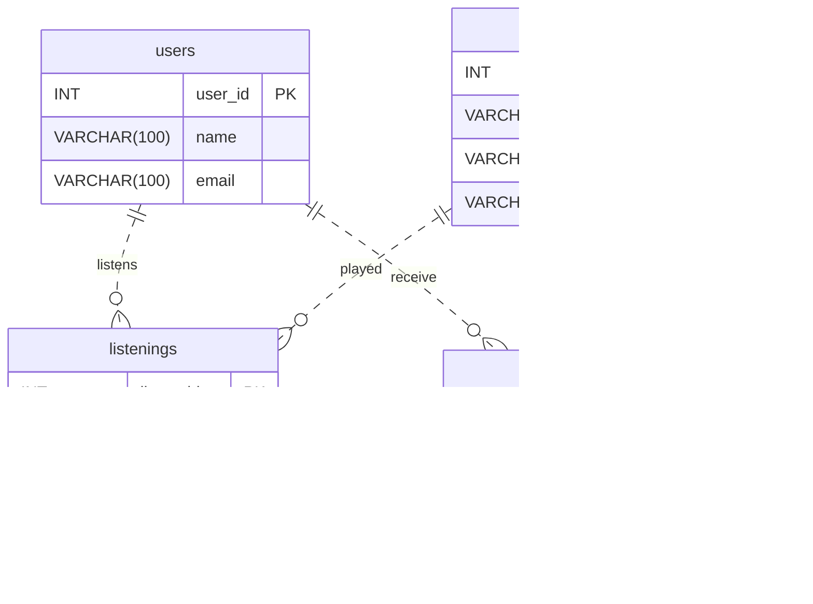

## Database ER Diagram

```mermaid
erDiagram
    users {
        INT user_id PK
        VARCHAR(100) name
        VARCHAR(100) email
    }
    songs {
        INT song_id PK
        VARCHAR(100) title
        VARCHAR(100) artist
        VARCHAR(100) genre
    }
    listenings {
        INT listen_id PK
        INT user_id FK
        INT song_id FK
        FLOAT rating
        TIMESTAMP listen_time
    }
    recommendations {
        INT recommendation_id PK
        INT user_id FK
        INT song_id FK
        TIMESTAMP recommendation_time
    }

    users ||..o{ listenings: listens
    songs ||..o{ listenings: played
    users ||..o{ recommendations: receive
    songs ||..o{ recommendations: recommended
```